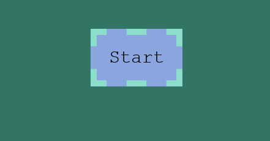
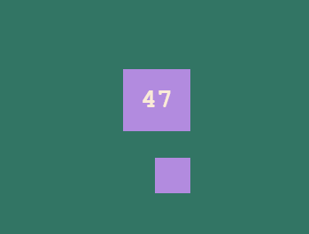
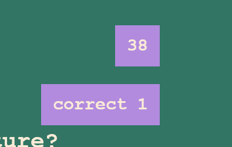
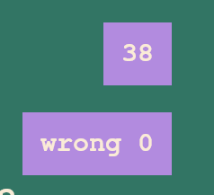
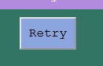
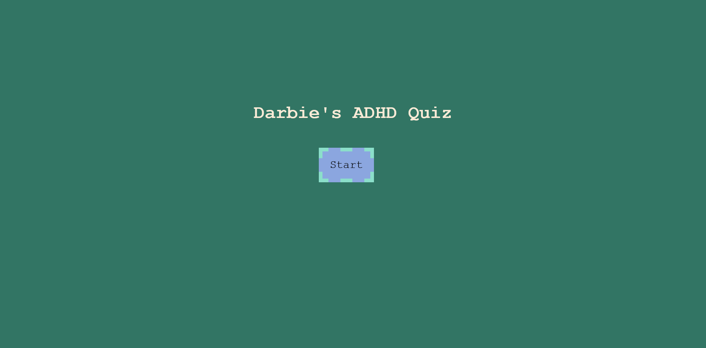

# Darbie’s ADHD Quiz

## Description

I wanted a fun quiz of random topics that I’ve learned. It contains questions about cats, bugs, the carboniferous period and color pigmentation. It takes the scores of previous players and adds them to a list so others can compare their scores to them! There are 60 second to complete the quiz and every wrong answer removes 10 seconds.
## Link
bwab
## Usage
To start the quiz click the start button.\
 \
Then answer all five questions to the best of your ability by clicking each desired answer.
\
In the top right corner there is the timer and a box that will display your score and if the question was answered correctly.
\
When all the questions are answered you type in your name or initials and click submit.
\
A list of previous scores will appear with your own added on!\
\
If you want to try again then click the retry button, under the list, and it will take you back to the start.\

## Screenshots

